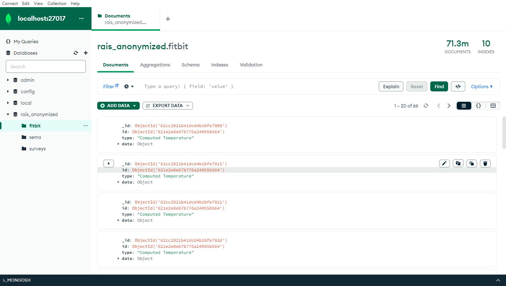

# pylifesnaps
A Python package for the extraction and analysis of data from the [LifeSnaps](https://zenodo.org/record/7229547) dataset.

## Setup

### LifeSnaps MongoDB
In order to start using this Python package, you need first to have downloaded and setup the [LifeSnaps](https://zenodo.org/record/7229547) dataset. In order to set it up on your local machine, you can follow these steps:

1. Install [MongoDB Community Edition](https://www.mongodb.com/try/download/community)
2. Install [MongoDB Command Line Database Tools](https://www.mongodb.com/try/download/database-tools)
3. *(Optional)* Install [MongoDB Compass](https://www.mongodb.com/products/tools/compass) 
4. Download the zip file from [LifeSnaps](https://zenodo.org/record/7229547)
5. Extract the zip file in a convenient location (you will need the path of the contained bson files in the next step)
6. On a terminal window, run the following commands, by replacing `<mongodb host>` with the host name of your MongoDB (by default `localhost`), `mongodb port` with the port of your MongoDB on your host (by default: `27017`) and the bson files that you have previously extractd (`<path to file *.bson>`) :

    - `mongorestore --host <mongodb host>:<mongo db port> -d rais_anonymized -c fitbit <path to file fitbit.bson>`
    - `mongorestore --host <mongodb host>:<mongo db port> -d rais_anonymized -c sema <path to file sema.bson>`
    - `mongorestore --host <mongodb host>:<mongo db port> -d rais_anonymized -c surveys <path to file surveys.bson>`
7. Running the previous commands load the backup `bson` files into your MongoDB. You can then use MongoDB Compass to query the database. This is what you should see in your MongoDB Compass window if everything was set up properly (in this case, the instance of MongoDB was running at `localhost:27017`)



### pylifesnaps
Once you have the LifeSnaps dataset up and running on your MongoDB, you can then start using pylifesnaps to extract and analyze the data.

First, install the package on your local machine:

1. `cd pylifesnaps`
2. `pip install --editable .`

Then, start exploring data using the embedded loader class:
```
loader = pylifesnaps.loader.LifeSnapsLoader(host='localhost', port=27017)

# Get first available user id
user_id = loader.get_user_ids()[0]

# Load sleep summary data with time filter
start_date = datetime.date(2021, 5, 22)
end_date = datetime.date(2021, 6, 6)
sleep_summary = loader.load_sleep_summary(
    user_id,
    start_date=start_date,
    end_date=end_date,
)

```

Enjoy 🎉

## Documentation
<s>Documentation for the package can be found on the official [Read The Docs page](pylifesnaps.readthedocs.io)</s>
Documentation can be built using Sphinx.

1. `cd pylifesnaps/docs`
2. `make html`

Then, open the `index.html` file that you find in `docs/_build/html/` in your browser to read the documentation.

## Contributing
Contributions are welcome. You can report issues on the dedicated GitHub [page](www.github.com/dado93/pylifesnaps/issues) and contribute to the code via pull requests.